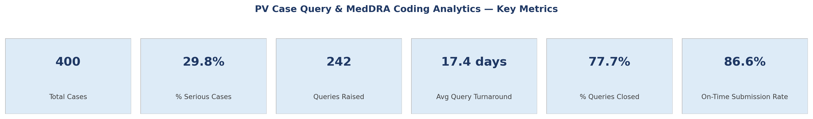
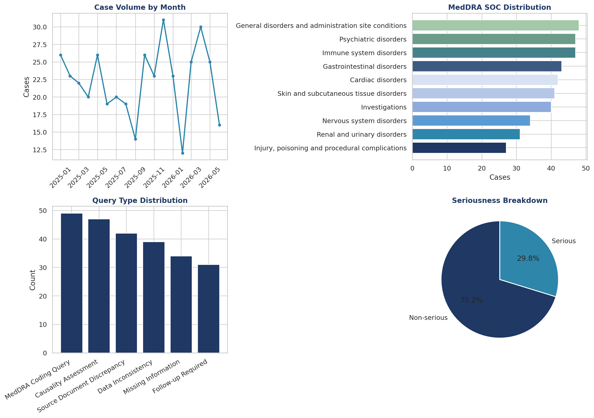
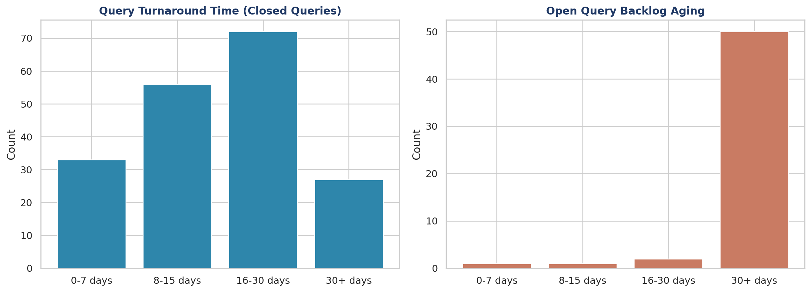

# PV Case Query & MedDRA Coding Analytics Dashboard

An Excel-based analytics dashboard simulating how a Pharmacovigilance (PV) Associate/Analyst
tracks Individual Case Safety Reports (ICSRs) through intake, MedDRA coding, data-management
queries, and expedited regulatory reporting timelines.

Built as a portfolio project to demonstrate PV/CDM operational analytics skills — case query
tracking, MedDRA coding distribution, and expedited-reporting compliance — using formulas only
(no hardcoded values), so the dashboard recalculates live if the underlying case data changes.

> ⚠️ All data in this project is **synthetically generated** (random seed = 42) for demonstration
> purposes only. It does not represent any real patient, product, or company.

---

## Why this project

Two operational functions sit at the core of every PV/CDM team's day-to-day work:

1. **Case query management** — tracking data-management queries raised against ICSRs (missing
   information, inconsistencies, coding queries) from open to close, and monitoring backlog aging.
2. **MedDRA coding oversight** — reviewing which System Organ Classes (SOCs) and Preferred Terms
   (PTs) are being coded most often, both for consistency and as an early signal-detection input.

This dashboard simulates both, plus a third layer most CDM/PV teams are measured against:
**expedited reporting timeliness** — whether Serious cases were submitted within the regulatory
deadline (ICH E2A/E2D-style).

This project pairs with two other repos in this portfolio:
- **Ozempic FAERS Signal Detection** — PRR-based disproportionality analysis on real openFDA data
- **OncoClear CDM Query Detection Pipeline** — simulated CDM query generation across a Phase II
  oncology trial
- **This project** — PV case query and MedDRA coding operational analytics

Together they cover three different angles of the CDM/PV data lifecycle: signal detection, CDM
query workflow, and PV case/query analytics.

---

## What's in the workbook

`PV_MedDRA_Query_Dashboard.xlsx` has three sheets:

| Sheet | Contents |
|---|---|
| **Instructions** | Project purpose, PV concepts demonstrated, and documented assumptions |
| **Raw Data** | 400 synthetic ICSR-style case records, formatted as an Excel Table |
| **Dashboard** | 6 live KPI cards + 6 charts, all formula-driven off Raw Data |

### Raw Data fields
`Case_ID` · `Receipt_Date` · `Product` · `MedDRA_SOC` · `MedDRA_PT` · `Seriousness` ·
`Country` · `Reporter_Type` · `Query_Raised` · `Query_Type` · `Query_Open_Date` ·
`Query_Close_Date` · `Days_to_Close` (formula) · `Submission_Date` ·
`Regulatory_Deadline_Days` (formula) · `Days_to_Submission` (formula) ·
`Submitted_On_Time` (formula) · `Open_Query_Age_Days` (formula)

### Dashboard KPIs
- Total Cases
- % Serious Cases
- Queries Raised
- Average Query Turnaround (days)
- % Queries Closed
- On-Time Submission Rate (Serious cases)

### Dashboard charts
- Case volume by month
- MedDRA SOC distribution
- Query type distribution
- Query turnaround time buckets (0–7 / 8–15 / 16–30 / 30+ days)
- Open query backlog aging
- Seriousness breakdown

---

## Screenshots

**Key metrics** (identical values to the live Excel dashboard — everything below is computed
straight from `Raw Data`, not hardcoded)

**Case volume trend, MedDRA SOC distribution, query type distribution, seriousness breakdown**

**Query turnaround time and open backlog aging**

> The actual deliverable is the Excel workbook (`PV_MedDRA_Query_Dashboard.xlsx`) — these charts
> are rendered separately from the same underlying data purely so they display cleanly on GitHub.
> Open the workbook to interact with the live formulas, filters, and native Excel charts.

---

## Key assumption

A flat **15-calendar-day** expedited reporting deadline is assumed for all Serious cases from
date of receipt. Real-world practice separates Fatal/Life-threatening Serious Unexpected cases
into a stricter 7-day clock per ICH E2A — that split was simplified here to keep scope
manageable for a portfolio project. This is documented on the Instructions sheet.

## Tools used
Microsoft Excel (formulas: `COUNTIFS`, `SUMIFS`, `AVERAGEIF`, `COUNTIF`, native Excel Tables and
charts). No external libraries — everything is native spreadsheet logic, matching how PV/CDM
teams commonly track these metrics operationally.

## Author
Nishanth  — Clinical Data Management / Pharmacovigilance, Chennai , India
